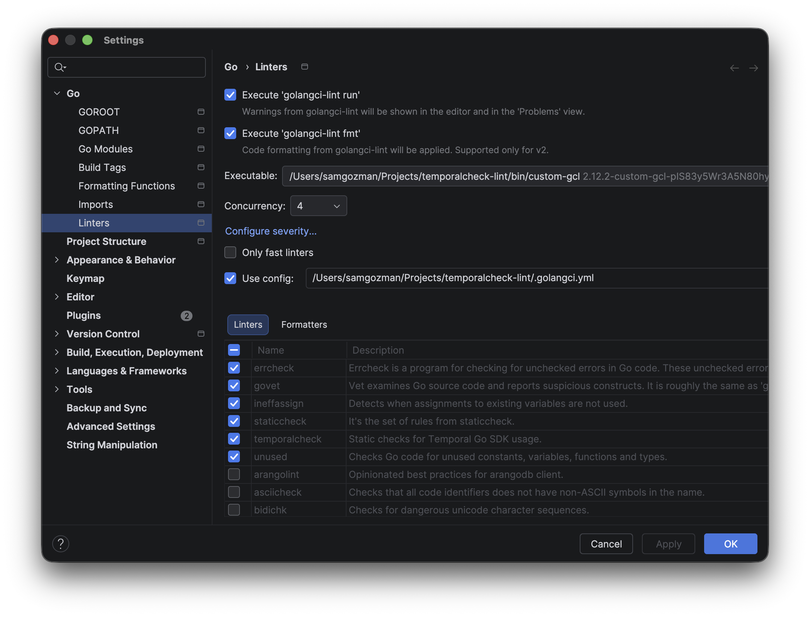

# temporalcheck-lint

[](https://github.com/samgozman/temporalcheck-lint/actions/workflows/ci.yml)
[](https://pkg.go.dev/github.com/samgozman/temporalcheck-lint)

A [golangci-lint](https://golangci-lint.run) module plugin for static analysis of [Temporal](https://temporal.io) Go SDK code.

Temporal's APIs take targets and arguments as `interface{}`, erasing compile-time safety. This plugin recovers those checks statically, catching bugs that only surface at run time.

## What it catches

```
workflow.go:14  ExecuteActivity: activity "Greet" expects 1 argument, got 0 (arity)
workflow.go:20  ExecuteActivity: arg 1 of "Greet" has type int, want string (strict-types)
workflow.go:26  WithActivityOptions: the returned context is discarded, so the options never apply (options-discard)
workflow.go:30  ActivityOptions sets no required timeout (required-timeout)
workflow.go:36  Get: the returned error from Future.Get is discarded (future-get)
workflow.go:42  activity "Charge" parameter 1 has dynamic type any; numbers lose precision past 2^53 (lossy-types)
workflow.go:48  activity "Stream" parameter 1 has type chan int; DataConverter cannot serialize a channel (unencodable)
workflow.go:54  NewContinueAsNewError: the continue-as-new error is discarded (continue-as-new)
workflow.go:60  ExecuteActivity: this ctx is configured with WithChildOptions, not WithActivityOptions (options-context)
worker.go:14   worker.Options: MaxConcurrentWorkflowTaskPollers must not be 1 -- the worker panics on start (worker-panic)
workflow.go:70  mutates package-level variable counter from workflow code (global-mutation)
workflow.go:76  logging via log in workflow code double-logs on every replay (workflow-logger)
```

## Analyzers

Most analyzers are on by default and fire only on a concrete mistake, so they're
safe to run as-is. Three are opt-in because they're heuristic or stylistic.

Several analyzers also carry their own settings that dial up how strictly they run —
for example, should `execargs` flag passing `[]*T` where `[]T` is expected (which the
`DataConverter` serializes identically), and should it check your test mocks too?
These stricter layers are **off by default** to keep the baseline false-positive-free,
but they catch real bugs and are **highly recommended** — turn them on once your repo
is clean (see the [full configuration reference](#install) and each analyzer's README).

### On by default

- **[`execargs`](temporalcheck/execargs)** — the core check. Verifies the argument
  count, and optionally the types, of `workflow.ExecuteActivity`,
  `workflow.ExecuteChildWorkflow` and `workflow.ExecuteLocalActivity` against the
  target function's real signature. Temporal passes arguments as `interface{}`, so a
  mismatch isn't a compile error — it panics the worker at run time. This is the main
  reason to run the plugin.
- **[`optionscontext`](temporalcheck/optionscontext)** — flags an
  `ExecuteActivity`/`ExecuteChildWorkflow` call whose context was built by a
  conflicting helper (e.g. `workflow.WithChildOptions` then `workflow.ExecuteActivity`),
  so the options it reads silently never apply. Like `execargs`, it catches a bug that
  otherwise only surfaces as a misbehaving or panicking worker in production.
- **[`optionsdiscard`](temporalcheck/optionsdiscard)** — flags
  `workflow.WithActivityOptions`, `workflow.WithLocalActivityOptions` and
  `workflow.WithChildOptions` calls whose returned context is discarded, so the
  options never take effect.
- **[`activitytimeout`](temporalcheck/activitytimeout)** — flags
  `workflow.ActivityOptions` / `workflow.LocalActivityOptions` literals with no
  `StartToCloseTimeout` or `ScheduleToCloseTimeout`, which Temporal rejects at run time.
- **[`futureget`](temporalcheck/futureget)** — flags a `Future.Get` (on
  `workflow.Future`, `workflow.ChildWorkflowFuture` or `converter.EncodedValue`) whose
  returned error is discarded, silently swallowing an activity or child-workflow failure.
- **[`continueasnew`](temporalcheck/continueasnew)** — flags a
  `workflow.NewContinueAsNewError` result that is discarded instead of returned, so the
  workflow silently ends instead of continuing as new.
- **[`lossynumber`](temporalcheck/lossynumber)** — flags `interface{}`/`any`,
  `map[string]any` and `[]any` activity/workflow parameters and returns: the JSON
  converter decodes numbers as `float64`, so an `int64` past 2^53 silently loses precision.
- **[`nonserializable`](temporalcheck/nonserializable)** — flags `chan` and `func`
  parameters and returns, which the `DataConverter` cannot serialize, so the call fails
  at run time.
- **[`workeroptions`](temporalcheck/workeroptions)** — flags `worker.Options` that set
  a `MaxConcurrentWorkflowTask*` field to `1`, which panics the worker on start.
- **[`workflowstate`](temporalcheck/workflowstate)** — flags mutation of a
  package-level variable from workflow code: shared state that breaks replay determinism
  and races across workflow executions.

### Off by default (opt in)

- **[`sensitiveargs`](temporalcheck/sensitiveargs)** — flags activity/workflow
  parameters and exported struct fields whose name matches a sensitive-data pattern
  (`password`, `secret`, `token`, `ssn`, `cvv`, card numbers…). Temporal records every
  argument in durable workflow history, so this is a first line of defence for keeping
  secrets and PII out of that history. Off by default because it's a name heuristic; the
  pattern is configurable.
- **[`workflowlogger`](temporalcheck/workflowlogger)** — flags non-replay-aware logging
  (`log`, `log/slog`, `fmt.Print*` and zerolog) from workflow code, which re-emits on
  every replay; use `workflow.GetLogger(ctx)` instead. Off by default because some teams
  wire their own logging.
- **[`stringtarget`](temporalcheck/stringtarget)** — flags `Execute*` calls that name
  their target by its registered string instead of a function reference, which can't be
  checked statically and blinds `execargs`. Off by default; opt in to be nudged toward a
  checkable function reference.

Each analyzer's linked README has full details, settings, and examples.

### Recommended: make your repo checkable first

For the best results, enable `stringtarget` and fix what it reports — replace
string-named `workflow.ExecuteActivity("Greet", …)` targets with a direct function
reference (`workflow.ExecuteActivity(ctx, a.Greet, …)`). A function reference can be
resolved to a real signature, while a registered string can't, so this single change
unblocks `execargs` (and `lossynumber`, `nonserializable`, `sensitiveargs`, which all
resolve the target the same way) on every one of those call sites. Once the code is in
that shape, the rest of the plugin — and your other Go linters — can see far more.

### Known limitations

The analyzers are deliberately conservative — they skip what they can't resolve
statically rather than risk a false positive — so a clean result is not a proof of
correctness. In particular:

- **The determinism checks (`workflowstate`, `workflowlogger`) only inspect code
  written directly inside the workflow function** (including its nested closures, e.g.
  `workflow.Go` callbacks). They do **not** follow calls into helper functions: a
  workflow that delegates to `helper(ctx)` where `helper` logs or mutates a package
  variable is not flagged. Keep determinism-sensitive logic in the workflow function,
  or review helpers it calls by hand.
- **Dot-imported SDK calls are out of scope.** Every analyzer matches `pkg.Func(...)`
  selector calls; if you `import . "go.temporal.io/sdk/workflow"` and call
  `ExecuteActivity(...)` bare, nothing is flagged. Import the SDK normally (the
  idiomatic and recommended form) to get full coverage.

## Install

Module plugins are compiled into golangci-lint itself; see the [Module Plugin System docs](https://golangci-lint.run/docs/plugins/module-plugins/).

1. Add `.custom-gcl.yml` to your project:

   ```yaml
   version: v2.12.2
   name: custom-gcl
   destination: ./bin
   plugins:
     - module: github.com/samgozman/temporalcheck-lint
       import: github.com/samgozman/temporalcheck-lint/temporalcheck
       version: v0.1.0
   ```

2. Build the custom binary:

   ```bash
   golangci-lint custom   # produces ./bin/custom-gcl
   ```

3. Enable it in `.golangci.yml`. The minimal config — every on-by-default analyzer
   running with its defaults, opt-in ones off:

   ```yaml
   version: "2"

   linters:
     enable:
       - temporalcheck
     settings:
       custom:
         temporalcheck:
           type: module
           description: Static checks for Temporal Go SDK usage.
           original-url: github.com/samgozman/temporalcheck-lint
   ```

4. Run it:

   ```bash
   ./bin/custom-gcl run
   ```

<details>
<summary>Full configuration reference</summary>

golangci-lint exposes the plugin as **`temporalcheck`**, and each analyzer has its own
nested settings block. This shows the full surface with **every check turned on** — the
recommended strict setup. Drop a line to fall back to its default (the comment marks
which settings are off by default):

```yaml
version: "2"

linters:
  enable:
    - temporalcheck
  settings:
    custom:
      temporalcheck:
        type: module
        description: Static checks for Temporal Go SDK usage.
        original-url: github.com/samgozman/temporalcheck-lint
        settings:
          execargs:
            disabled: false              # turn the analyzer off without unwiring the plugin
            strict-types: true           # also verify argument types, not just the count (default false)
            strict-pointers: true        # flag T vs *T mismatches the converter hides (default false)
            strict-struct-shape: true    # flag a different struct passed where one is wanted (default false)
            strict-tests: true           # also check OnActivity/OnWorkflow mock matcher arity (default false)
          optionscontext:
            disabled: false              # flag Execute* using a context built by a conflicting With*Options
          optionsdiscard:
            disabled: false              # flag With*Options calls whose returned context is discarded
          activitytimeout:
            disabled: false              # flag ActivityOptions with no required timeout
            require-start-to-close: true # also require StartToCloseTimeout when only ScheduleToClose is set (default false)
          futureget:
            disabled: false              # flag a Future.Get whose returned error is discarded
          continueasnew:
            disabled: false              # flag a NewContinueAsNewError result that is discarded, not returned
          lossynumber:
            disabled: false              # flag any/map[string]any/[]any params that lose number precision
          nonserializable:
            disabled: false              # flag chan/func params the DataConverter cannot serialize
            empty-struct: true           # also flag a struct with no exported fields (encodes to {}) (default false)
          workeroptions:
            disabled: false              # flag worker.Options that panic the worker on start
            require-options: true        # also flag worker.New with no concurrency limits set (default false)
          workflowstate:
            disabled: false              # flag mutation of package-level vars from workflow code
          sensitiveargs:
            enabled: true                # flag params/fields whose name looks sensitive (PII/secrets) (default false)
            pattern: "(?i)cvv|pan|card.?number|password|secret|ssn|token"  # names matched (unanchored)
          workflowlogger:
            enabled: true                # flag non-replay-aware logging in workflow code (default false)
          stringtarget:
            enabled: true                # flag string-named Execute* targets (blinds execargs) (default false)
            strict-tests: true           # also flag string-named OnActivity/OnWorkflow targets (default false)
```

</details>

## Editor integration

A custom golangci-lint binary works with your IDE just like the stock one. You
only have to point the IDE at *your* binary (`./bin/custom-gcl`) instead of the
one on your `PATH`. Build it first (see [Install](#install)), then configure the IDE.

<details>
<summary>JetBrains GoLand IDE</summary>

1. Open **Settings → Go → Linters**.
2. Tick **Execute 'golangci-lint run'** (and **'golangci-lint fmt'** if you
   want formatting too).
3. Set **Executable** to the absolute path of your custom binary, e.g.
   `/path/to/your/project/bin/custom-gcl`.
4. Tick **Use config** and point it at your `.golangci.yml`.
5. Click **OK**. `temporalcheck` now shows up in the linters list and its
   warnings appear inline in the editor and in the **Problems** view.



</details>

## Suppressing with `//nolint`

Use the plugin name **`temporalcheck`** (not an analyzer name):

```go
// Suppress one call:
_ = workflow.ExecuteActivity(ctx, a.Greet) //nolint:temporalcheck // registered by name elsewhere

// Suppress an entire file (before the package clause):
//nolint:temporalcheck
package worker
```

A directive naming only other linters (`//nolint:gocritic`) does not suppress this plugin. To disable an analyzer project-wide, use its `disabled` setting.

## Running in CI

CI is the same steps as local use: install upstream golangci-lint, build the
custom binary from `.custom-gcl.yml`, then lint with it. See the
[`custom` command docs](https://golangci-lint.run/docs/plugins/module-plugins/)
for details, and this repo's own [`.github/workflows/ci.yml`](.github/workflows/ci.yml)
for a working example:

```yaml
- name: Install golangci-lint
  run: |
    curl -sSfL https://raw.githubusercontent.com/golangci/golangci-lint/HEAD/install.sh \
      | sh -s -- -b "$(go env GOPATH)/bin" v2.12.2

- name: Build the custom binary
  run: golangci-lint custom   # reads .custom-gcl.yml

- name: Lint
  run: ./bin/custom-gcl run
```

Keep the golangci-lint version pinned the same in `.custom-gcl.yml` and your CI.

## Development

See [CONTRIBUTING.md](CONTRIBUTING.md).

## License

MIT. See [LICENSE](LICENSE).
